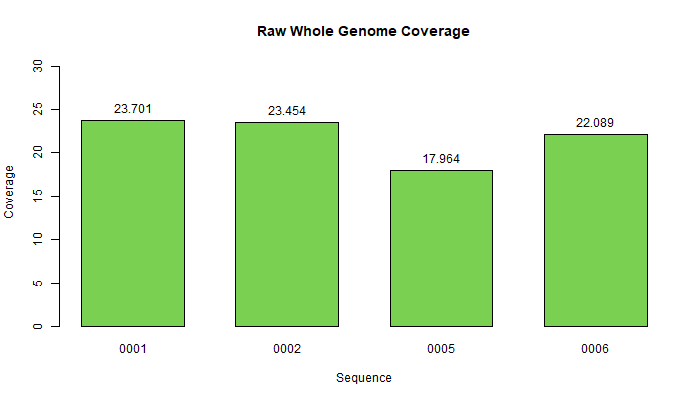
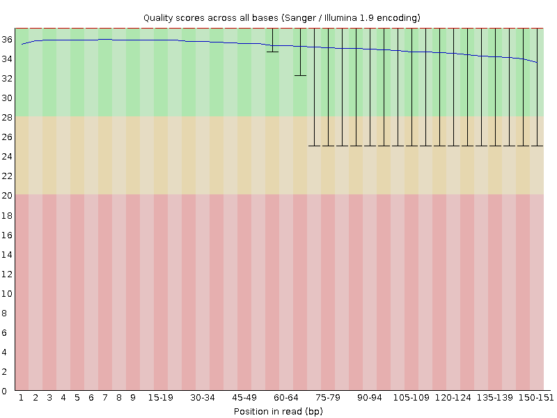
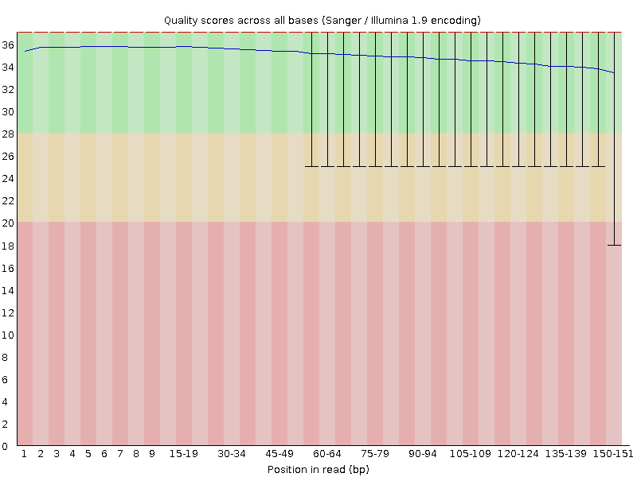

## Step 1: Quality Assessment 

### Discussion

The goal of this step was to determine the overall quality of our raw sequencing data. To increase the efficiency of our analyses, we reduced our sample size to 4 individuals: 2 affected males (0001, 0002) and 2 carrier females (0005, 0006).

Given that the per base sequence quality of our data is relatively high (above 30 for all samples), our group has decided not to trim our data. The whole genome coverage of sequences, as depicted in Figure 1 and Table 1, was calculated using the equation  
`(number of reads x read length)/genome size`.

### Scripts
- **[1_quality.sh](scripts/1_quality.sh):** Generate quality assessment reports using `FastQC` (see Table 2).  
  - FastQC using `GNU parallel` (using the most efficient number of cores available) on all files ending with .fastq.gz   
```
ls *.fastq.gz | parallel -j+0 --eta 'fastqc {}' 
```


### Graphical Analysis

#### Coverage

  

__Figure 1.__ A bar graph showing coverage for each sample at different stages of processing (values in Table 1).  

<br>

| Sample ID | Raw Whole Genome |
|:---------:|:----------------:|
|   0001    |      23.701      |
|   0002    |      23.454      |
|   0005    |      17.964      |
|   0006    |      22.089      |

__Table 1.__ Calculated coverage of the raw data for the whole genome by sample.  

<br>

#### FastQC Graphs of Raw Data

| __Sample 0001__ |  __Forward__ | __Reverse__ |
| :------: | :------: | :------: |
|Per base sequence quality|||
| __Sample 0002__ |  __Forward__ | __Reverse__ |
|Per base sequence quality ||| 
| __Sample 0005__ |  __Forward__ | __Reverse__ |
|Per base sequence quality|||
| __Sample 0006__ |  __Forward__ | __Reverse__ |
|Per base sequence quality|||

__Table 2.__ Per base quality assessment reports by sample (from FastQC). 

#### Side Note
Galaxy was run on data that was of public domain. Our group did an analysis in galaxy comparing FastQC in galaxy versus FastQC on the command line. These comparisons can be found linked below as well as on the main README page. This analysis helped us decide to move forward doing FastQC on the command line only for the data used within this project.

  
#### [Step 1 Practice Report: Initial quality assessment of raw NGS data](practice_reports/STEP_1.md)

### Contributions

Jacqueline Barry: graphical analysis and discussion  
Rebecca Nance: uploaded data to the ASC, ran FastQC on the command line   
Cassidy Schneider: graphical analysis and discussion   
Kyndall Skelton: graphical analysis and discussion  
