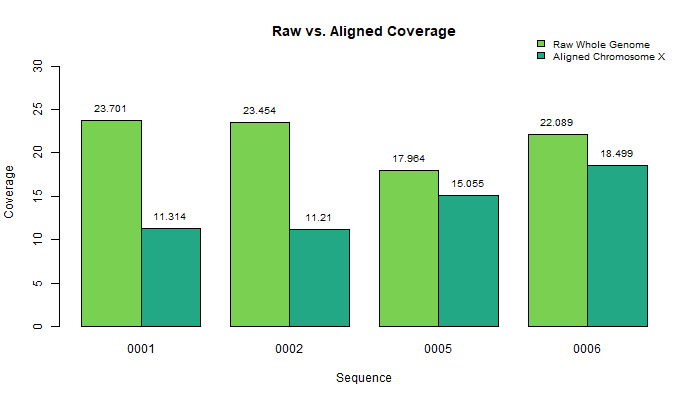

## Step 2: Alignment of sequencing reads to reference genome

### Discussion

We first indexed our canine reference genome (canFam6) using bwa mem and the script: [0_index_genome.sh](scripts/0_index_genome). We then aligned the samples to the reference genome (CanFam6) using the script: [3_align_chrX.sh](scripts/3_align_chrX.sh). Given that the muscular dystrophy disorder that we are investigating is X-linked, we subset by the X chromosome using `samtools view`. We used `samtools flagstat` and `samtools depth` to summarize the alignment quality of our sequences, and then generated a bar plot of coverage, including raw and aligned data using the script: [create_figures.R](scripts/create_figures.R). The same script was used to produce a bar plot of percent mapped.
  
We decided not to trim our samples since all Phred scores indicated high quality DNA as evidenced by the results of 'FASTQC' (see step 1).
  
#### Comparing raw coverage to aligned coverage

There is a large difference in the raw coverage and aligned coverage values. The raw coverage was calculated for the whole genome, while the aligned coverage was calculated for just the X chromosome. _The X chromosome makes up approximately 4.705% of the genome. We can use this information to perform a rough estimate of the raw coverage of the X chromosome (Table 1). However, this estimate assumes equal coverage across the genome._  

#### Different percent mapped for the whole genome and the X chromosome

For one sample (0001), we determined percent mapped for the whole genome before extracting the sequences that mapped to the X chromosome. We then determined the percent mapped for just the X chromosome. For the whole genome, 74.81% mapped, and for the X chromosome, 87.05% mapped.

### Figures

  

__Figure 1.__ A bar plot showing coverage for each sample at different stages of processing (values in Table 1).  

 

| Sample ID | Raw Whole Genome | Aligned Chromosome X |
|:---------:|:----------------:|:--------------------:|
|   0001    |      23.701      |       11.3141        |
|   0002    |      23.454      |       11.2097        |
|   0005    |      17.964      |       15.0552        |
|   0006    |      22.089      |       18.4987        |

__Table 1.__ Comparing coverage values. _The estimated raw X chromsome (chrX) coverage was calculated for each sample by multiplying the whole genome raw coverage value by 0.04705._  

 
  

__Figure 2.__ A bar plot showing the percent mapped for the X chromosome for each sample (values in Table 2).  

 

| Sample ID | Whole Genome | X Chromosome |
|:---------:|:------------:|:------------:|
|   0001    |    74.81     |    87.05     |
|   0002    |    76.41     |    88.57     |
|   0005    |    74.32     |    86.89     |
|   0006    |    75.05     |    87.55     |

__Table 2.__ The percent mapped to the whole genome and X chromosome for each sample.  
  
 

### Script Markdown: [3_align_chrX.sh ](scripts/3_align_chrX.sh)
1.) use bwa mem to create sam (aligned sequence file)   
`bwa mem -M -v 2 -t 8 -R "@RG\tID:$sample.$flowcell.$lane_id\tSM:$sample\tPU:$flowcell.$lane_id\tPL:Illumina\tLB:$flowcell.$lane_id" $ref $forward $reverse \   >${PROJDIR}/$sample.sam`
 
2.) use samtools to convert sam to bam  
`samtools view -Sb -@ 8 $sample.sam >$sample.bam`  
  
3.) use samtools to sort bam  
`samtools sort -@ 8 -m 1500MB $sample.bam >$sample.sorted.bam`  
  
4.) use samtools to index the sorted bam  
`samtools index $sample.sorted.bam`
  
5.) use samtools to extract the aligned chrX from the sorted bam  
`samtools view -b -@ 8 $sample.sorted.bam chrX >"${CHRXDIR}/${sample}.chrX.sorted.bam"`  
  
6.) use samtools to index the chrX  
`samtools index ${sample}.chrX.sorted.bam`

### Contributions

Jacqueline Barry: graphical analysis and discussion  
Rebecca Nance: technical support and troubleshooting  
Cassidy Schneider: ran alignment to reference genome and subset to X chromosome  
Kyndall Skelton: indexed reference genome  
