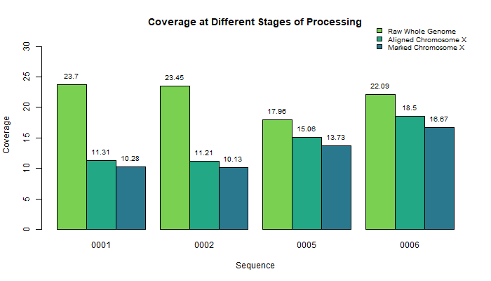
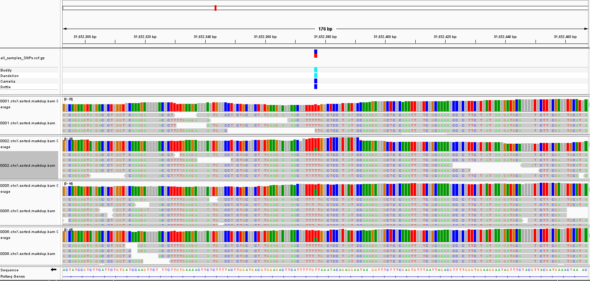

## Step 3: Post-alignment processing

### Discussion:

This step of the analysis picks up at the end of step 2. The output from the alignment script from Step 2 was run through the duplicate script: [3_duplicates.sh](scripts/3_duplicates.sh), which sorted, indexed, and marked duplicates for the BAM files from each of our 4 samples. `samtools depth` was used to determine the overall coverage of the marked BAM files. These coverage values were compared to those calculated at previous processing steps (Figure 1). The percent of sequences that are duplicates was determined using `samtools flagstat` (Figure 2). The plots were generated in `RStudio` using the script: [create_figures.R](scripts/create_figures.R). The [dup_metrics.sh](scripts/dup_metrics.sh) script was used to determine the preceding metrics. We used Intergrated Genome Viewer (IGV) to visually inspect our sequences.

### Scripts:

- **[3_duplicates.sh](scripts/3_duplicates.sh):**
  - Sort, index, and mark duplicates for the BAM files.
- **[dup_metrics.sh](scripts/dup_metrics.sh):**
  - Determine coverage of the marked BAM files using `samtools depth`.
  - Get metrics using `samtools flagstat`.
  - Note: percent duplicates is calculated in the script: [stat_csv.sh](scripts/stat_csv.sh) from the metrics file output by `3_duplicates.sh`.
- **[create_figures.R](scripts/create_figures.R):**
  - Generate a bar plot of coverage, including raw, aligned, and marked data.
  - Generate a bar plot of percent duplicates.

### Figures

__Figure 1.__ Bar plot of coverage across several stages of processing (values in Table 1).

| Sample ID | Raw Whole Genome | Aligned Chromosome X | Marked Chromosome X |
|:---------:|:----------------:|:--------------------:|:-------------------:|
|   0001    |      23.701      |       11.3141        |       10.2846       |
|   0002    |      23.454      |       11.2097        |       10.1347       |
|   0005    |      17.964      |       15.0552        |       13.7334       |
|   0006    |      22.089      |       18.4987        |       16.6656       |

__Table 1.__ Coverage values.

 

__Figure 2.__ Bar plot of the percentage of duplicate reads (values in Table 2).

| Sample ID | Percent Duplicates |
|:---------:|:------------------:|
|   0001    |      13.0134       |
|   0002    |      13.5146       |
|   0005    |      11.2256       |
|   0006    |      12.4551       |

__Table 2.__ Percent of duplicate reads.

 

#### IGV Analysis Highlights

__Figure 3.__ Screenshot of IGV comparing coverage before and after marking duplicates for each sample.  

 

__Figure 4.__ Comparison of "good" vs. "bad" SNPs in terms of coverage. "Good" SNPs will be supported with high coverage for all samples; in this case, sample 0001 (top of figure) shows poor coverage for this particular SNP, as evidenced by the 0001.chrX.sorted.markdup.bam Coverage track. 
 

#### Contributions
Jacqueline Barry: graphical analysis and discussion  
Rebecca Nance: IGV analysis  
Cassidy Schnieder: gathered quality metrics  
Kyndall Skelton: sorted, indexed, and marked duplicates  
