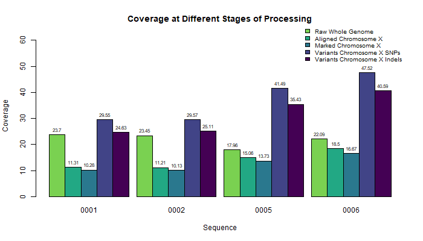
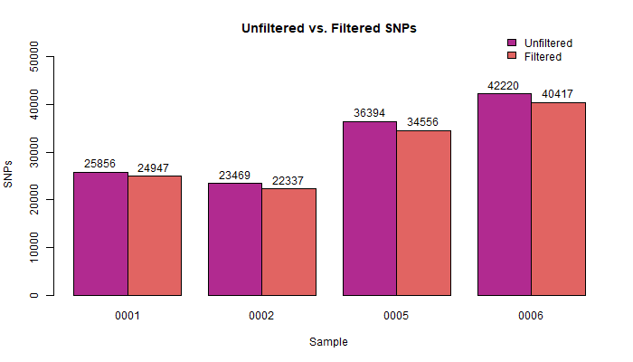
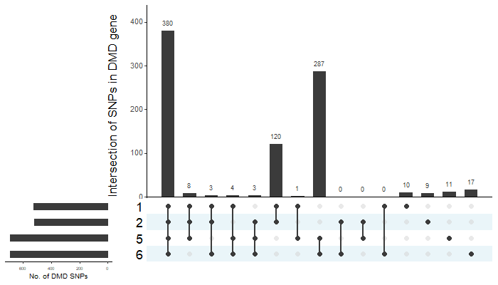
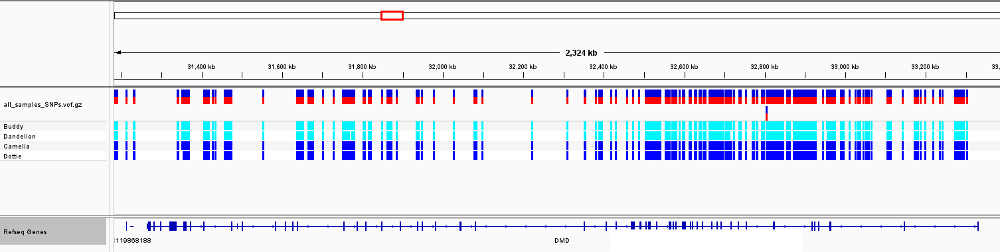
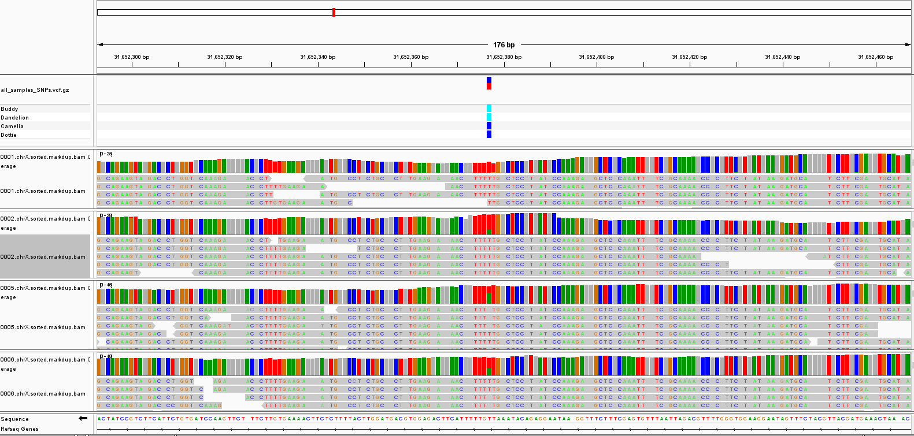

## Step 4: Variant calling

### Overview

The script [4_variants.sh](scripts/4_variants.sh) was used to perform variant calling, utilizing `GATK HaplotypeCaller`. The script also extracts only SNP variants using `GATK SelectVariants` and filters variants using `GATK VariantFiltration`. Coverage was determined for the resulting VCF files using `vcftools`. These coverage values were plotted alongside data from previous processing steps to facilitate comparison (Figure 1). The VCF files were compared to the BAM files using IGV.

### Scripts

- **[4_variant_call.sh](scripts/4_variant_call.sh):**  
1. Call variants according to ploidy based on gender of dog  
```
# Male
  gatk --java-options "-Xmx8G" HaplotypeCaller \
      -R "$ref" \
      -I "${sample}.markdup.bam" \
      --sample-ploidy 1 \
      -L chrX \
      -O "${VCFDIR}/$sample.g.vcf.gz" \
      -ERC GVCF
```  

```
# Female
   gatk --java-options "-Xmx8G" HaplotypeCaller \
      -R "$ref" \
      -I "${sample}.markdup.bam" \
      --sample-ploidy 2 \
      -L chrX \
      -O "${VCFDIR}/$sample.g.vcf.gz" \
      -ERC GVCF
```
  2. Extract SNP variants  
```
  gatk SelectVariants -R "$ref" --variant "$sample.vcf.gz" --select-type-to-include SNP --output "${VCFDIR}/$sample.SNPs.vcf"
```
    
  3. Hard filter variants using the GATK suggested SNP filtering parameters to filter out low-quality SNPs  
```
  gatk VariantFiltration -R "$ref" --variant "$sample.SNPs.vcf" \  
    --filter-expression "QD < 2.0" --filter-name "QD2" \  
    --filter-expression "QUAL < 30.0" --filter-name "QUAL30" \  
    --filter-expression "SOR > 3.0" --filter-name "SOR3" \  
    --filter-expression "FS > 60.0" --filter-name "FS60" \  
    --filter-expression "MQ < 40.0" --filter-name "MQ40" \  
    --filter-expression "MQRankSum < -12.5" --filter-name "MQRankSum-12.5" \  
    --filter-expression "ReadPosRankSum < -8.0" --filter-name "ReadPosRankSum-8" \  
    --output "$sample.SNPs.filtered.vcf" 
```
  4. Determine coverage for the resulting VCF files  
```
  vcftools --gzvcf "$sample.SNPs.filtered.vcf.gz" --depth --out "$sample.SNPs" 
 ```
  
- **[5_select_variant.sh](scripts/5_select_variant.sh)**  
1. Select variants that are hemizygous for an alternate allele in the males        
```
 bcftools view -i 'GT="alt"' \
  -o "${sample}.chrX.sorted.SNPs.filtered.select.vcf" \
  "${sample}.chrX.sorted.SNPs.filtered.vcf.gz" 
 ```
  2. Select variants that are heterozygous for an alternate allele in the females    
```
  bcftools view -i 'GT="het"' \
    -o "${sample}.chrX.sorted.SNPs.filtered.select.vcf" \
    "${sample}.chrX.sorted.SNPs.filtered.vcf.gz" `  
```
  3. Intersect the selected variants and find positions that are in all 4 samples   
```
  bcftools isec \
    -n =4 -p intersect_SNP \
    0001.chrX.sorted.SNPs.filtered.select.vcf.gz \
    0002.chrX.sorted.SNPs.filtered.select.vcf.gz \
    0005.chrX.sorted.SNPs.filtered.select.vcf.gz \
    0006.chrX.sorted.SNPs.filtered.select.vcf.gz 
```
  4. Merge files containing selected variants
```
  bcftools merge -f .,PASS 0000.vcf.gz 0001.vcf.gz 0002.vcf.gz 0003.vcf.gz >all_samples_SNPs.vcf
```
- **[create_figures.R](scripts/create_figures.R):**  
  - Generate a bar plot of coverage, including data from previous steps.  
  - Generate a bar plot of number of SNPs, unfiltered and filtered.  
  - Generate an upset plot of the intersection of sample SNPs within the DMD gene.  

### Discussion

#### Coverage

The coverages from Step 1 were calculated for the raw whole genome. Compared to what was observed in the raw data coverage, the aligned chromosome coverage decreased, then further decreased after marking duplicates. However, when comparing the coverages calculated for all Chromosome X variants, the coverage increased significantly compared with the raw whole genome. For each sample, SNP coverage was higher than indels. Between samples, the first two samples (0001 and 0002) had coverages that were very similar. Sample 0005 had markedly higher coverage, and Sample 0006 had the highest coverage overall at all stages of processing (Table 1).

  

__Figure 1.__ A bar graph showing coverage for each sample at different stages of processing (values in Table 1).

| Sample ID | Raw Whole Genome | Aligned Chromosome X | Marked Chromosome X |Variants Chromosome X SNPs   | Variants Chromosome X Indels|
|:---------:|:----------------:|:--------------------:|:-------------------:|:---------------------------:| :--------------------------:|
|   0001    |      23.701      |       11.3141        |       10.2846       |           29.5533           |            24.6290          |
|   0002    |      23.454      |       11.2097        |       10.1347       |           29.5656           |            25.1147          |
|   0005    |      17.964      |       15.0552        |       13.7334       |           41.4852           |            35.4306          |
|   0006    |      22.089      |       18.4987        |       16.6656       |           47.5243           |            40.5858          |

__Table 1.__ Coverage values.

<br>

### Analysis of SNPs

#### Filtering

Analysis and summary were performed to identify SNPs of interest within the Dystrophin gene (DMD). As stated in the main README, the DMD gene is of interest because it is thought to be the causative gene for muscular dystrophy in dogs. The analysis on the command line produced a high volume of SNPs in chromosome X as seen by the unfiltered section in Figure 2 and Table 2. The low quality SNPs were then hard-filtered out using the parameters noted above. Figure 2 shows the difference in number of SNPs before and after quality filtering. The filtered SNPs were then analyzed on IGV and USCS Genome browser to preview the SNPs located within the X chromosome that were deemed high quality. The overview of the SNP locations within the DMD gene can be seen below in Figure 3. 



__Figure 2.__ Bar plot comparing filtered versus unfiltered SNPs in chromosome X.

| Sample ID | Unfiltered | Filtered |
| --------- | ---------- | -------- |
| 0001      | 25,856     | 24,947   |
| 0002      | 23,469     | 22,337   |
| 0005      | 36,394     | 34,556   |
| 0006      | 42,220     | 40,417   |

__Table 2.__ Filtered versus unfiltered values.

#### SNPs of Interest 

After hard-filtering and selecting SNPs based on quality and zygosity, 1682 SNPs were found in all four samples across the entirety of the X chromosome. Of those 1682 SNPs, 380 were found to be of interest and located within the DMD gene. Table 3 and Figure 3 reflect this conclusion. Figure 3 shows all intersections of SNPs within the DMD region of the X chromosome. The SNPs were then placed into IGV which allowed for visualization of SNP location within the DMD gene (Figure 4). The SNPs were also visualized based on coverage in IGV to determine the overall quality of the SNPs (Figure 5). 

| X Chromosome | DMD Gene |
| ------------ | -------- |
| 1682        | 380      |

__Table 3.__ Number of SNPs present in all four samples after quality filtering and selecting only SNPs that are hemizygous in males and heterozygous in females.



__Figure 3.__ Upset plot of the intersect between sample SNPs within the DMD gene


  

__Figure 4.__ A screenshot of IGV showing SNPs of interest within the dystrophin (DMD) gene. Light blue blocks correspond to homozygous (hemizygous) SNPs within the males while dark blue corresponds to heterozygous SNPs within the females.



__Figure 5.__ Comparison of "good" vs. "bad" SNPs in terms of coverage. "Good" SNPs will be supported with high coverage for all samples; in this case, sample 0001 (top of figure) shows poor coverage for this particular SNP, as evidenced by the 0001.chrX.sorted.markdup.bam Coverage track.

<br>

#### Contributions

Jacqueline Barry: graphical analysis and discussion  
Rebecca Nance: command line data assessment/IGV assessment    
Cassidy Schnieder: command line data assessment  
Kyndall Skelton: graphical analysis and discussion  
