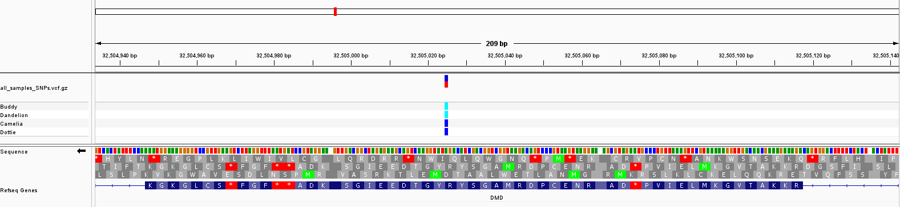
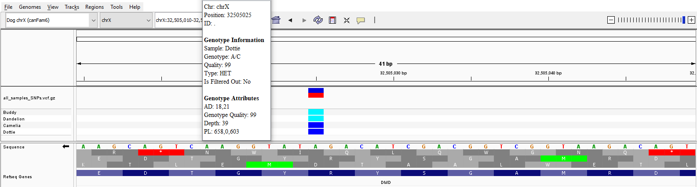

## Step 5: Data Analysis

### Overview
We manually inspected these variants within IGV and their location in the gene. The annotated reference file (canFam6.chrX.json) was loaded into IGV along with the VCF file containing the SNPs of interest (all_samples_SNPs.vcf.gz). This variant file contains SNPs on the X chromosome that are hemizygous in all affected males and heterozygous in all carrier females. 
    
### Conclusions
We first looked for SNPs that were present in exons on the DMD gene. Though we expected to find none, since prior cDNA sequencing indicated no mutations, one SNP was identified within an exon. This SNP was hemizygous for C in the affected males, and heterozygous for A/C in the carrier females. These results suggest that this particular SNP could be the DMD-causing mutation in the Springer Spaniel, though more work is needed to validate these claims.  
 

__Figure 2.__ Screenshot of the SNP present within a DMD exon. 
    

### Future Directions  
We plan to continue this work by adding more samples (2 additional affected males and 2 additional carrier females) and analyze for INDELs as well. We hope to implement some additional tools (such as Snpeff) to narrow our variants to identify functionally relevant SNPs/INDELs. In this way, we can look for mutations that are more likely to produce an effect on the DMD protein. 
