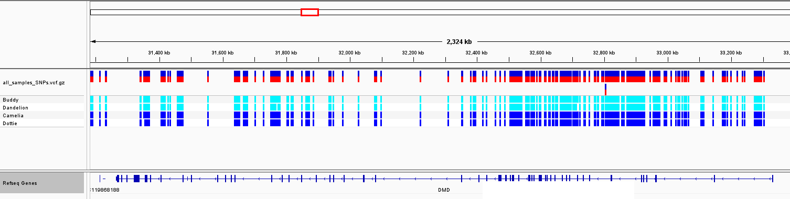

## Step 5: Data Analysis

### Overview
We manually inspected these variants by uploading the vcf file containing the common SNPs among all dogs into IGV (https://software.broadinstitute.org/software/igv/). The annotated reference file (canFam6.chrX.json) was loaded into IGV along with the VCF file containing the SNPs of interest (all_samples_SNPs.vcf.gz). This variant file contains SNPs on the X chromosome that are hemizygous in all affected males and heterozygous in all carrier females. We then zoomed into the DMD gene to visualize and analyze the SNPs present.

### Discussion
After isolating a list of SNPs that were common between the affected and carrier females on the X chromosome, we then isolated our search for SNPs of interest to the DMD gene. 

  

We further narrowed our search for SNPs that were present within _exons_ of the DMD gene. Though we expected to find none, since prior cDNA sequencing indicated no mutations, one SNP was identified within an exon (at position 32505025). This SNP, located in exon 34 (position 32504947-32505117), was hemizygous for C in the affected males, and heterozygous for A/C in the carrier females. Therefore, the mutation causes a change from C to A at position 32505025 on the X chromosome. Exon 34 is translated from reading frame 1. This results in a silent mutation because it does not affect the encoded amino acid (Alanine), and therefore, is not predicted to affect the protein's function. However, the identification of this mutation expands on prior studies seeking genotype to phenotype associations with Duchenne Muscular Dystrophy in dogs.

  

__Figure 1.__ A screenshot of IGV showing all SNPs of interest within the dystrophin (DMD) gene. Light blue blocks correspond to homozygous (hemizygous) SNPs within the males while dark blue corresponds to heterozygous SNPs within the females.

__Figure 2.__ Screenshot of the SNP present within a DMD exon (bottom=zoomed in). 

Coverage quality for the exon 34 SNP was highest in sample 0001 (Buddy), 0006 (Dottie), and 0002 (Snapdragon). Sample 0005 (Camelia) showed approximately 1/4 coverage compared to the others.  

__Figure 3.__ Screenshot of the coverage for the exon 34 SNP from the marked duplicates bam files. 
 
### Discrepancy in IGV Reading Frame
IGV showed a discrepancy in how the reading frames were displayed. IGV showed that exon 34 was translated from the 3rd reading frame, whereas UCSC showed that it was translated from the first reading frame. This discrepancy can be explained by IGV displaying frame 1 as the third line of translation. 

  

 __Figure 3.__ Screenshot of IGV and UCSC browser showing a discrepancy in how the reading frames are displayed. Amino acid sequence "MELT" (boxed in red) is shown in reading frame 3 in IGV (left) but shown in reading frame 1 in UCSC browser (right).
  
### Future Directions  
We plan to continue this work by adding more samples (2 additional affected males and 2 additional carrier females) and analyze for INDELs as well. We hope to implement some additional tools (such as Snpeff) to narrow our variants to identify functionally relevant SNPs/INDELs. In this way, we can look for mutations that are more likely to produce an effect on the DMD protein. To validate the final results, we will sequence the PCR product of an unaffected/non-carrier female Springer Spaniel. 

### Contributions
Jackie Barry: graphical analysis and discussion  
Rebecca Nance: IGV analysis and discussion  
Cassidy Schneider: command line analysis and IGV consultation  
Kyndall Skelton: graphical analysis and discussion  

