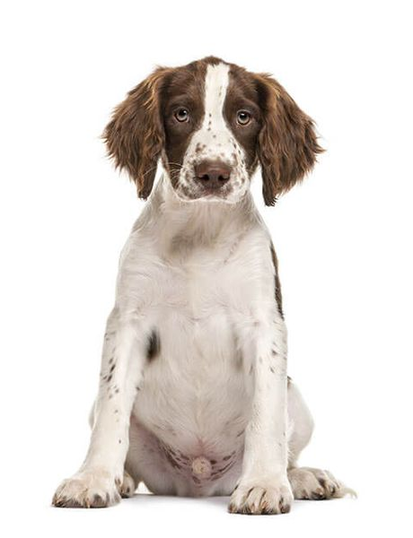
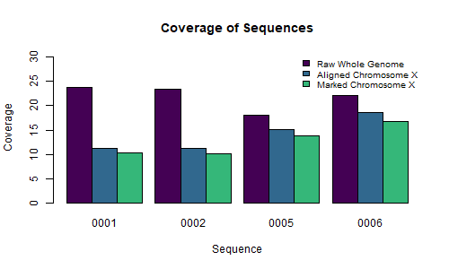

# Muscular Dogstrophy
_Identifying the Mutation Responsible for Duchenne Muscular Dystrophy in the Springer Spaniel_
### Jacqueline Barry, Rebecca Nance, Cassidy Schneider, Kyndall Skelton
  

 

## Introduction
Muscular dystrophy is a term that includes many inherited diseases that affects muscle function. Duchenne Muscular Dystrophy (DMD), the most common subtype, occurs in both humans and dogs. This disease is characterized by a defect in the gene that encodes the protein dystrophin, which plays a critical role in muscle structure and function. Consequently, movement and mobility are impaired and affected individuals progressively become weaker. Eventually, the muscles in the heart and/or diaphragm are compromised, leading to premature death or euthanasia (1). The dystrophin gene (DMD) is located on the X chromosome and therefore, obeys traditional X-chromosome inheritance pattern. The DMD gene contains 86 exons and is approximately 2,100 kb in length. Our lab maintains one of the few canine colonies for studying DMD in the dog. Breed-specific mutations have been identified in a few breeds, including Golden Retriever (2), Rottweiler (3), and Corgi (4), among others (1). However, the mutation responsible for DMD in the Springer Spaniel has yet to be elucidated. Previous attempts to identify the mutation using sequencing of cDNA from affected dogs yielded no conclusive mutation. To address this question, we used genomic sequencing data from 2 affected males and 2 carrier females from our Springer Spaniel colony. We aligned our sequences to the canine reference genome (`canFam6`) and specifically isolated the X chromosome from our sequences. We then marked any duplicates, calculated coverage, and identified SNPs that were hemizygous in the males and heterozygous in the females in the DMD gene. We manually inspected these variants and their location in the gene in order to identify the mutation responsible for DMD in the Springer Spaniel.

## Bioinformatic Pipeline

## Samples
Genomic DNA was isolated from 4 affected males and 4 carrier females from the Springer Spaniel Duchenne-Like Muscular Dystrophy dog colony in Dr. Bruce F. Smith's lab at the Auburn University College of Veterinary Medicine. Samples were sequenced as 150bp paired-end reads using the NovaSeq 6000 platform with ~30x coverage at HudsonAlpha Discovery in Huntsville, AL.

| File ID | Dog | Description | Whole Genome Coverage | Aligned ChrX Coverage | Marked ChrX Coverage | 
| --- | --- | --- | --- | --------- | -------| 
| 0001 | Buddy | Affected Male | 23.7 | 11.31 | 10.28 |
| 0002 | Dandelion | Affected Male | 23.45 | 11.21 | 10.13 |
| 0005 | Camelia | Carrier Female | 17.96 | 15.06 | 13.73 |
| 0006 | Dottie | Carrier Female | 22.09 | 18.5 | 16.67 |

__Table 1.__ Data description and coverage values throughout processing. 

### Figures

__Figure 1.__ Bar plot of coverage across several stages of processing (values in Table 1).

## Results  

### Number of SNPs

| X Chromosome | DMD Gene |
| ------------ | -------- |
| 1682        | 380      |

__Table 2.__ Number of SNPs present in all four samples after quality filtering and selecting only SNPs that are hemizygous in males and heterozygous in females.

## Conclusions & Future Directions
On the command line, the script `var_metrics.sh` was used to determine that there was an enormous amount of SNPs identified on the DMD gene. Most of these SNPs were located within introns/non-coding regions. Though we expected to find no mutations within exons, since prior cDNA sequencing indicated no mutations, one SNP was identified within an exon. This SNP, located in exon 34 (position 32504947-32505117), was hemizygous for C in the affected males, and heterozygous for A/C in the carrier females. Therefore, the mutation causes a change from C to A at position 32505025 on the X chromosome. This is a silent mutation because it does not affect the encoded amino acid (Alanine). Exon 34 is translated from reading frame 1.  
  
We plan to continue this work by adding more samples (2 additional affected males and 2 additional carrier females) and analyze for INDELs as well. We hope to implement some additional tools (such as Snpeff) to narrow our variants to identify functionally relevant SNPs/INDELs. In this way, we can look for mutations that are more likely to produce an effect on the DMD protein. To validate the final results, we will sequence the PCR product of an unaffected/non-carrier female Springer Spaniel.

 

## Reports

#### [Step 1 Report: Initial quality assessment of raw NGS data](1_Quality_Assessment.md)
#### [Step 2 Report: Alignment of sequencing reads to reference genome](2_Alignment.md)
#### [Step 3 Report: Post-alignment processing](3_Duplicates.md)
#### [Step 4 Report: Variant calling](4_Variant_Call.md)
#### [Data Analysis](5_Data_Analysis.md)
 

## Practice Data Reports

Before the sequencing data was received, example data was used to develop the pipeline.
#### [Step 1 Practice Report: Initial quality assessment of raw NGS data](practice_reports/STEP_1.md)

## References
1. Kornegay, J.N., Bogan, J.R., Bogan, D.J. et al. Canine models of Duchenne muscular dystrophy and their use in therapeutic strategies. Mamm Genome 23, 85–108 (2012)   
2. Sharp NJ, Kornegay JN, Van Camp SD, Herbstreith MH, Secore SL, Kettle S, Hung WY, Constantinou CD, Dykstra MJ, Roses AD, Bartlett RJ (1991) An error in dystrophin mRNA processing in golden retriever muscular dystrophy, an animal homologue of Duchenne muscular dystrophy. Genomics 13:115–121  
3. Winand N, Pradham D, Cooper B (1994) Molecular characterization of severe Duchenne-type muscular dystrophy in a family of Rottwiler dogs. In: Molecular mechanism of neuromuscular disease. Muscular Dystrophy Association, Tucson  
4. Smith BF, Yue Y, Woods PR, Kornegay JN, Shin JH, Williams RR, Duan D (2011) An intronic LINE-1 element insertion in the dystrophin gene aborts dystrophin expression and results in Duchenne-like muscular dystrophy in the Corgi breed. Lab Invest 91:216–231    
