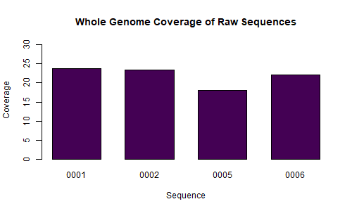

## Step 1: Initial Quality Assessment of Raw NGS Data

### Discussion

The goal of this step was to determine the overall quality of our raw sequencing data. We used the command line tool `FastQC` on the Alabama Supercomputer to generate quality assessment reports (see Table 2). Given that the per base sequence quality of our data is relatively high (above 30 for all samples), our group has decided not to filter our reads. The whole genome coverage of sequences, as depicted in Figure 1 and Table 1, was calculated using `(number of reads x read length)/genome size`.

### Graphical Analysis

#### Coverage

  

__Figure 1.__ A bar graph showing coverage for each sample at different stages of processing (values in Table 1).  

 

| Sample ID | Raw Whole Genome |
|:---------:|:----------------:|
|   0001    |      23.701      |
|   0002    |      23.454      |
|   0005    |      17.964      |
|   0006    |      22.089      |

__Table 1.__ Calculated coverage of the raw data for the whole genome by sample.  

 

#### FastQC Graphs

| __Sample 0001__ |  __Forward__ | __Reverse__ |
| :------: | :------: | :------: |
|Per base sequence quality|||
| __Sample 0002__ |  __Forward__ | __Reverse__ |
|Per base sequence quality ||| 
| __Sample 0005__ |  __Forward__ | __Reverse__ |
|Per base sequence quality|||
| __Sample 0006__ |  __Forward__ | __Reverse__ |
|Per base sequence quality|||

__Table 2.__ Per base quality assessment reports by sample (from FastQC). 

 

### Contributions

Jacqueline Barry: graphical analysis and discussion  
Rebecca Nance: uploaded raw data to the Alabama Super Computer and ran FastQC on the command line 
Cassidy Schneider: graphical analysis and discussion  
Kyndall Skelton: graphical analysis and discussion  
