## Step 1: Initial Quality Assessment of Raw NGS Data

### Move forward or continue filtering?
Based on the results, our group agrees that filtering to exclude poor quality reads would be appropriate. Despite inconsistencies in the FASTQC quality reports between Galaxy and ASC, we agree that trimming of the last 10 bp should be performed for all samples due to poor quality as evidenced by Phred scores below 20. Additional trimming may need to be performed on individual samples.  
 

### Graphical Analysis
__Per Base Sequence Quality__

| Sample | Per Base Quality Forward | Per Base Quality Reverse |
| :------: | :------: | :------: |
|0001|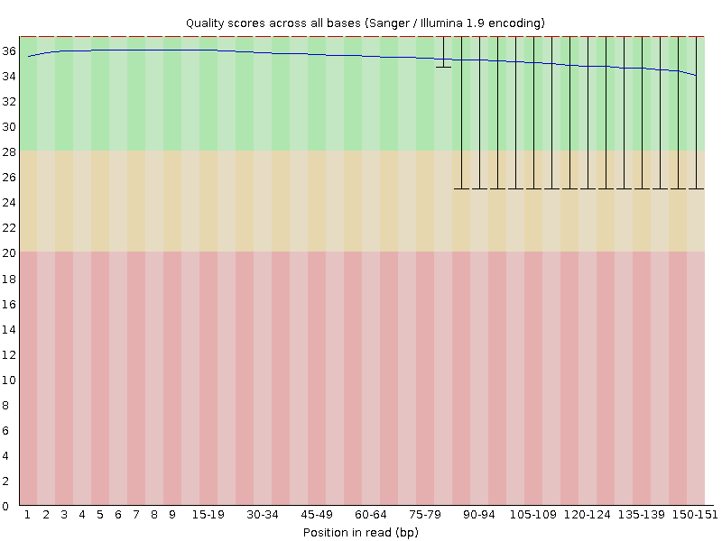|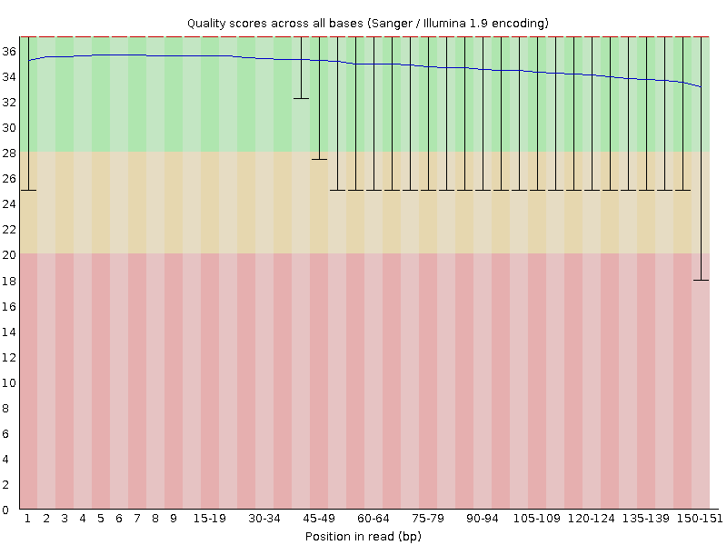|
|0002|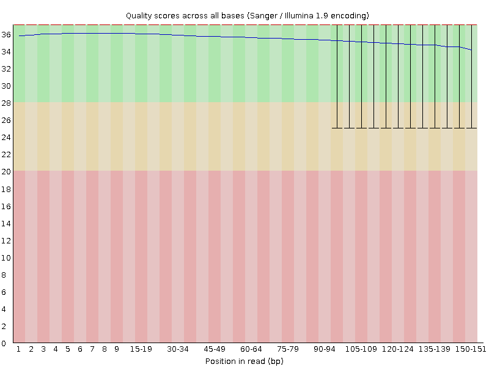||
|0003||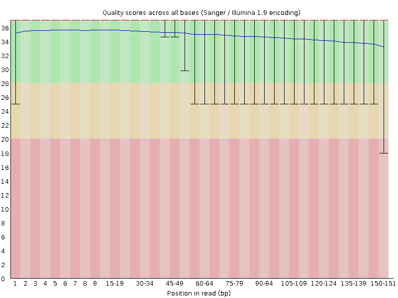|
|0004||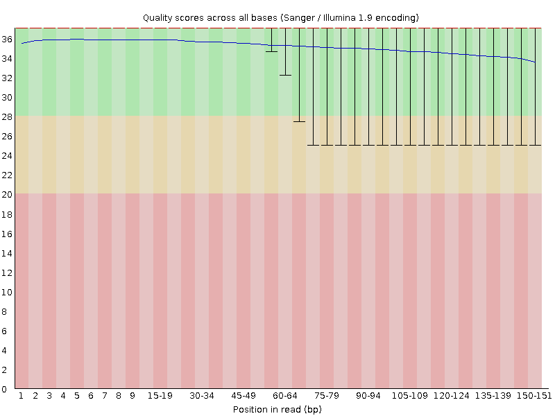|
|0005|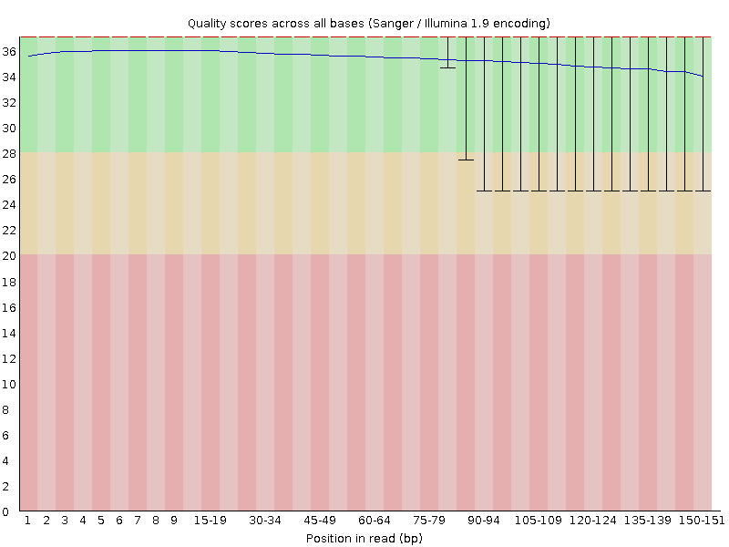|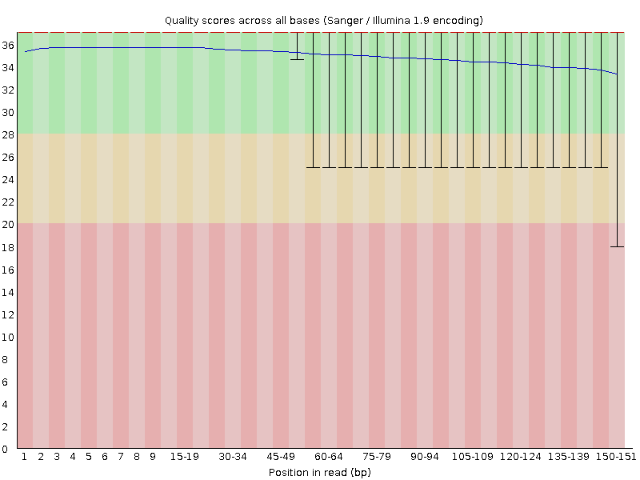|
|0006|||
|0007||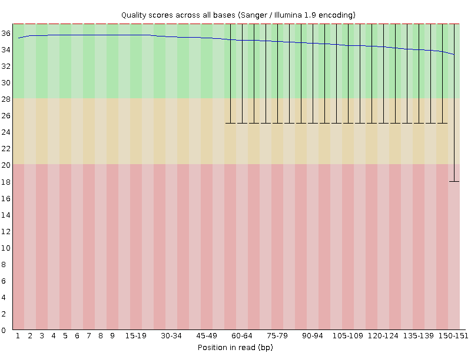|
|0008||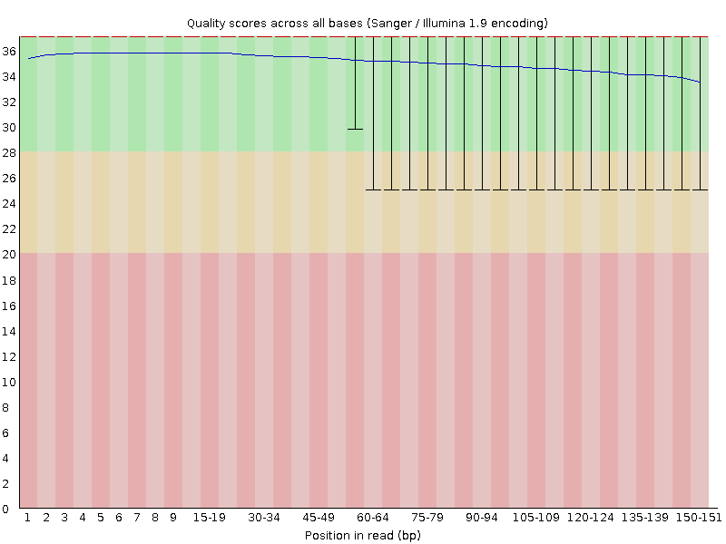|

### FastQC Graphs for Sample 0001

| Quality Check | Forward | Reverse |
| :------: | :------: | :------: |
|[PASS] Per base sequence quality|||
|[WARNING] Per tile sequence quality|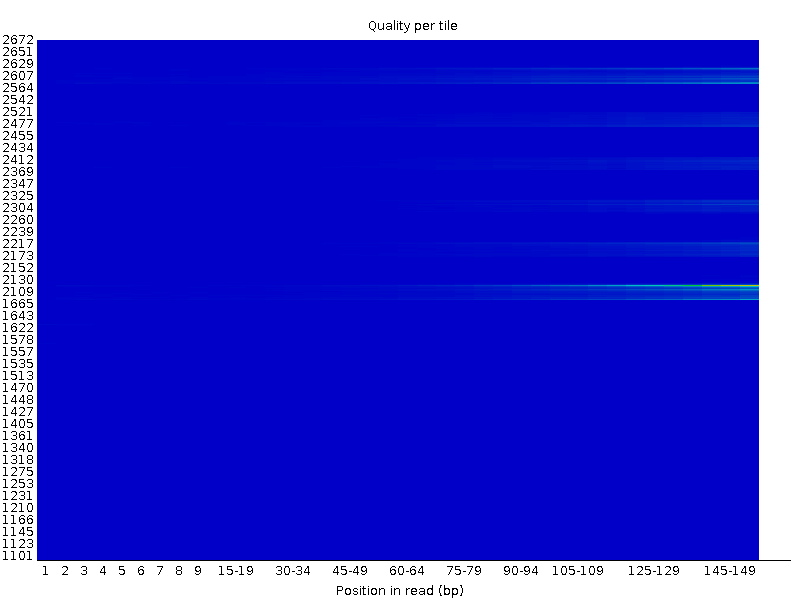||
|[PASS] Per sequence quality scores|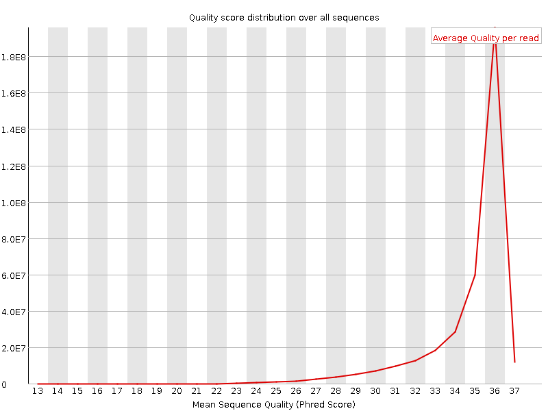|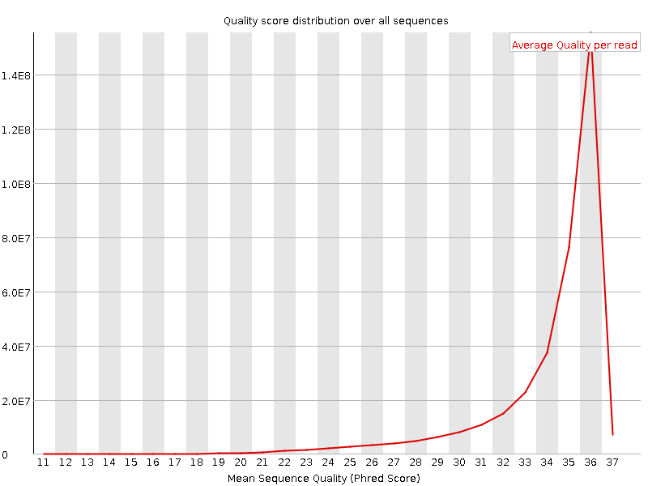|
|[WARNING] Per base sequence content|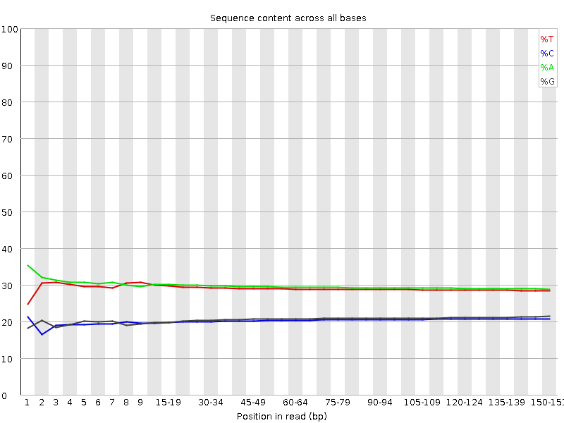|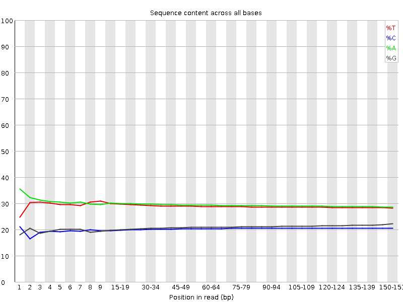|
|[PASS] Per base N content|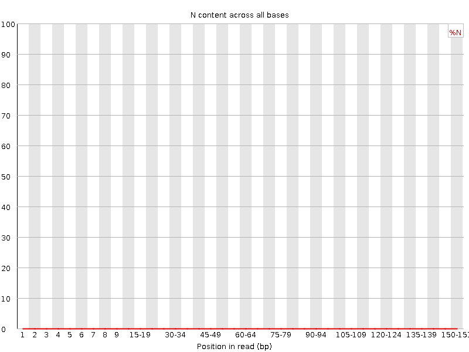||
|[PASS] Sequence Length Distribution|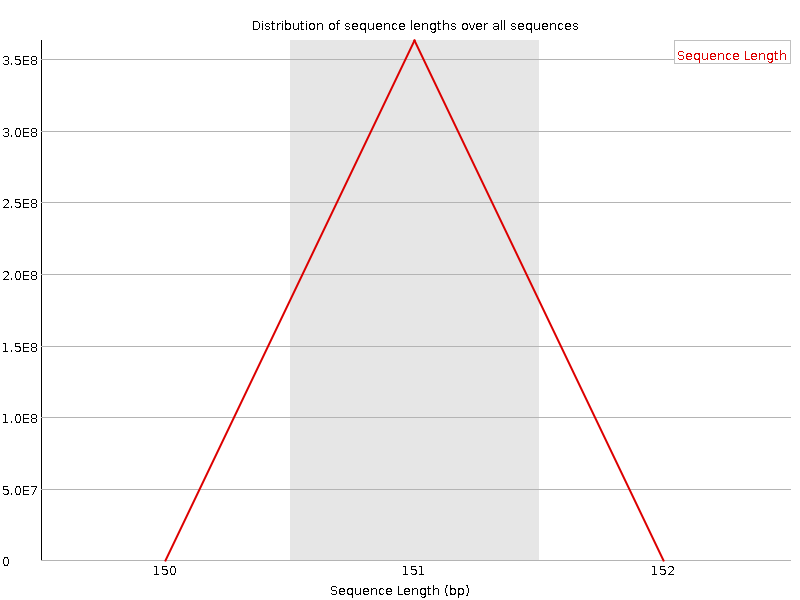||
|[PASS] Sequence Duplication Levels|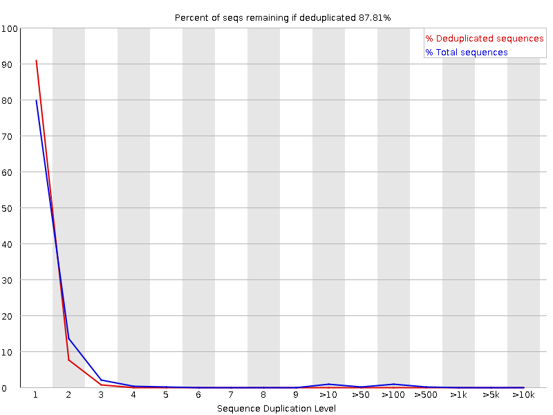|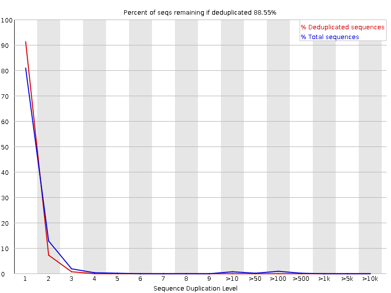|
|[PASS] Adapter Content|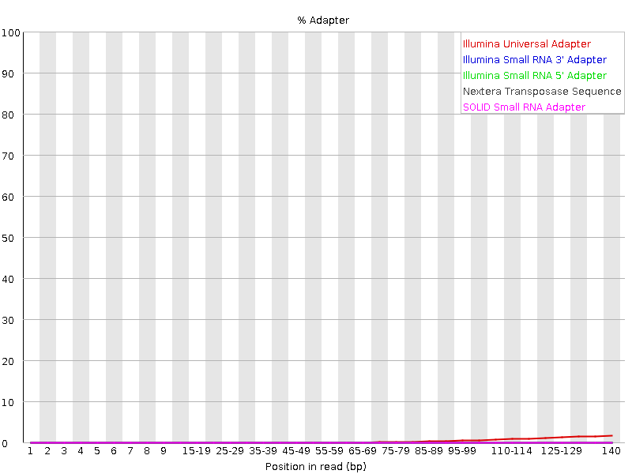|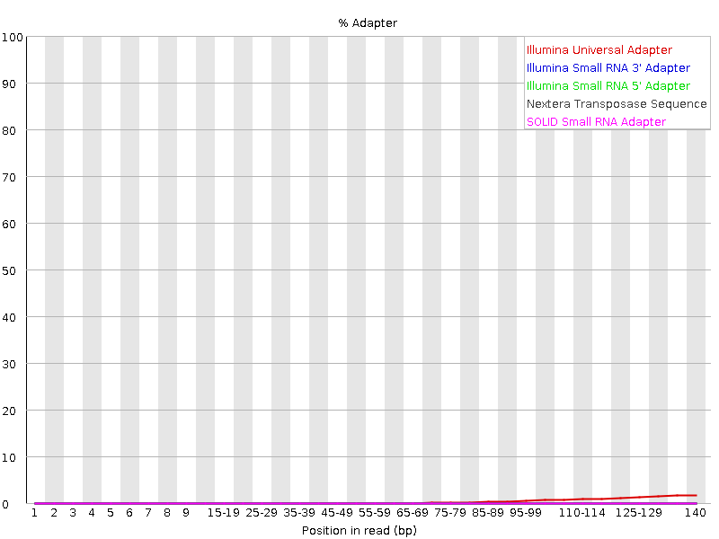|
