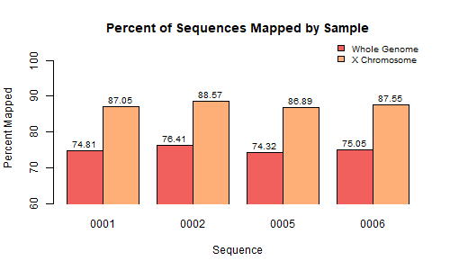

## Step 2: Alignment of sequencing reads to reference genome

### Process 

1. Index the reference genome (canFam6) using `bwa mem`. Script: `0_index_genome.sh`
2. Consider trimming. 
3. Align samples to the reference genome. Script: `3_align_chrX.sh`
4. Subset X chromosome using `samtools view`.
5. Consider aligning untrimmed reads and comparing to trimmed reads.
6. Summarize alignment quality using `samtools flagstat` and `samtools depth`.
7. Compare coverage between raw and aligned data.
8. Create a bar graph of coverage, including raw and aligned data. Script: `coverage.R`
9. Create a histogram of percent mapped. Script: `percent_mapped.R`

### Discussion

#### Trimming

We decided not to trim our samples.

#### Comparing raw coverage to aligned coverage.

There is a large difference in the raw coverage and aligned coverage values. The raw coverage was calculated for the whole genome, while the aligned coverage was calculated for just the X chromosome. The X chromosome makes up approximately 4.705% of the genome. We can use this information to perform a rough estimate of the raw coverage of the X chromosome (Table 1). However, this estimate assumes equal coverage across the genome.  

#### Different percent mapped for the whole genome and the X chromosome

For one sample (0001), we determined percent mapped for the whole genome before extracting the sequences that mapped to the X chromosome. We then determined the percent mapped for just the X chromosome. For the whole genome, 74.81% mapped, and for the X chromosome, 87.05% mapped.

#### Visualizing coverage and percent mapped

_These scripts are still running, so we don't have all the values yet to make the graphs. Once we make the graphs it will be easier to compare sequences and their quality at different stages of processing.__

### Figures

  

__Figure 1.__ A bar graph showing coverage for each sample at different stages of processing (values in Table 1?).

| Sample ID | Whole Genome Raw Coverage | Estimated Raw chrX Coverage | Aligned chrX Coverage |
| :-----: | :-----: | :-----: | :-----: |
| 0001 | 23.701 | 1.11513 | 11.3141 |
| 0002 | 23.454 | 1.10351 |  |
| 0003 | 20.936 | 0.985039 |  |
| 0004 | 25.68  | 1.20824 |  |
| 0005 | 17.964 | 0.845206 |  |
| 0006 | 22.089 | 1.03929 |  |
| 0007 | 25.502 | 1.19987 |  |
| 0008 | 23.214 | 1.09222 |  |

__Table 1.__ Comparing coverage values. The estimated raw X chromsome (chrX) coverage was calculated for each sample by multiplying the whole genome raw coverage value by 0.04705. 

  
  
  

__Figure 2.__ A histogram showing the percent mapped for the X chromosome for each sample (values in Table 2).  

| Sample ID | Percent Mapped (chrX) |
| :-----: | :-----: |
| 0001 | 87.05 |
| 0002 |  |
| 0003 |  |
| 0004 |  |
| 0005 |  |
| 0006 |  |
| 0007 |  |
| 0008 |  |

__Table 2.__ The percent mapped for the X chromosome for each sample.  
