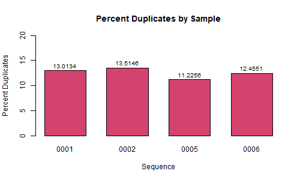
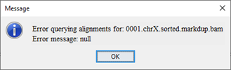
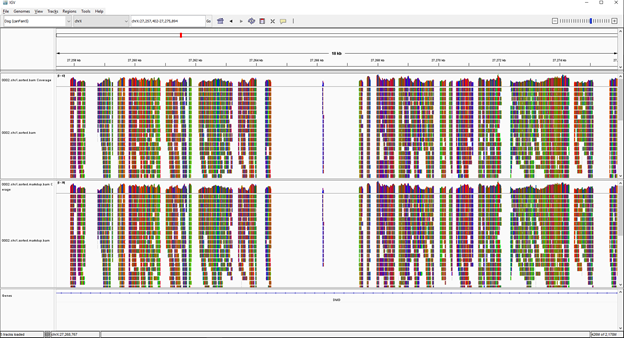
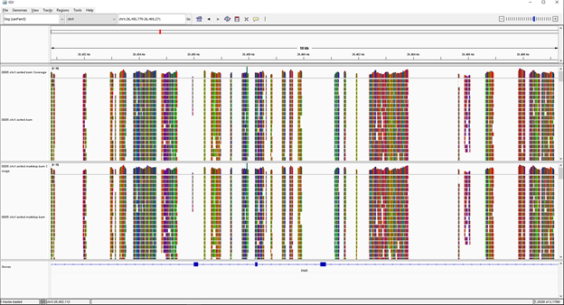
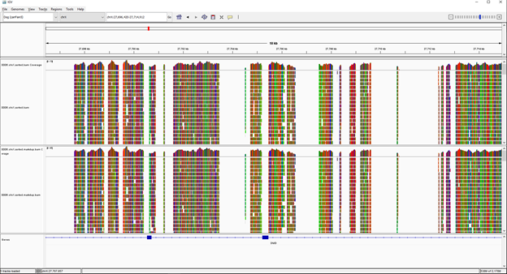

## Step 3: Post-alignment processing

#### Discussion:
This step of the analysis picks up at the end of step 2. The output from the alignment script from Step 2 was run through the duplicate script: `4_duplicates.sh`, which sorted, indexed, and marked duplicates for the BAM files from each of our 4 samples. `samtools depth` was used to determine the overall coverage of the marked BAM files. These coverage values were compared to those calculated at previous processing steps (Figure 1). The percent of sequences that are duplicates was determined using `samtools flagstat` (Figure 2). The plots were generated in `RStudio` using the script: `create_figures.R`. The `dup_metrics.sh` script was used to determine the preceding metrics. 

3. IGV Genome Viewer:
a. Take screen shots from IGV of before and after to show quality improvement during Step 3 for each individual BAM file. b. Select screenshots that best display the information of sample improvement, highlights, and important differences between specific sets of sequences.

### Figures

__Figure 1.__ Bar plot of coverage across several stages of processing (values in Table 1).

| Sample ID | Raw Whole Genome | Aligned Chromosome X | Marked Chromosome X |
|:---------:|:----------------:|:--------------------:|:-------------------:|
|   0001    |      23.701      |       11.3141        |       10.2846       |
|   0002    |      23.454      |       11.2097        |       10.1347       |
|   0005    |      17.964      |       15.0552        |       13.7334       |
|   0006    |      22.089      |       18.4987        |       16.6656       |

__Table 1.__ Coverage values.

 

__Figure 2.__ Bar plot of the percentage of duplicate reads (values in Table 2).

| Sample ID | Percent Duplicates |
|:---------:|:------------------:|
|   0001    |      13.0134       |
|   0002    |      13.5146       |
|   0005    |      11.2256       |
|   0006    |      12.4551       |

__Table 2.__ Percent of duplicate reads.

 

#### IGV

Screenshot Highlights:

_Sequence 0001_

_Sequence 0002_

_Sequence 0005_

_Sequence 0006_

#### Contributions
Jacqueline Barry: graphical analysis and discussion  
Rebecca Nance: IGV analysis  
Cassidy Schnieder: gathered quality metrics  
Kyndall Skelton: sorted, indexed, and marked duplicates  
