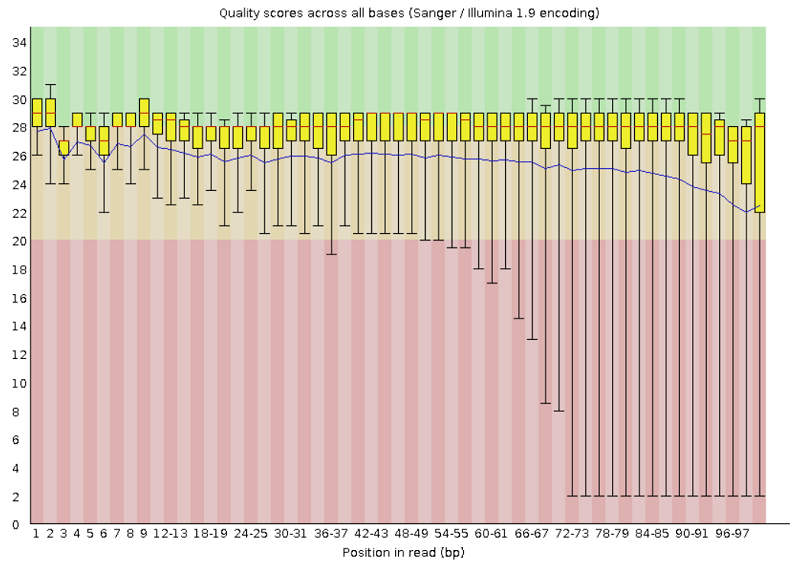
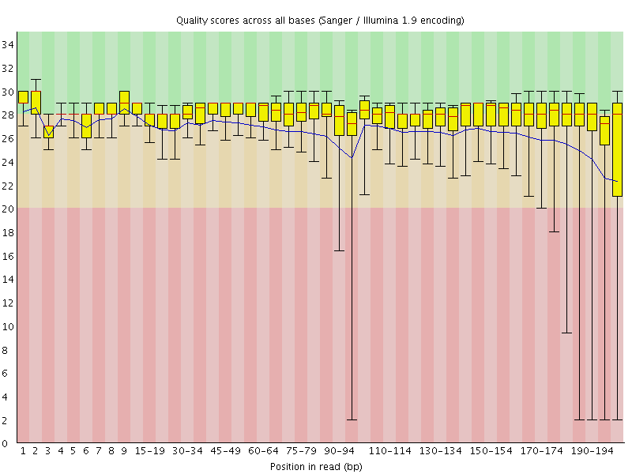
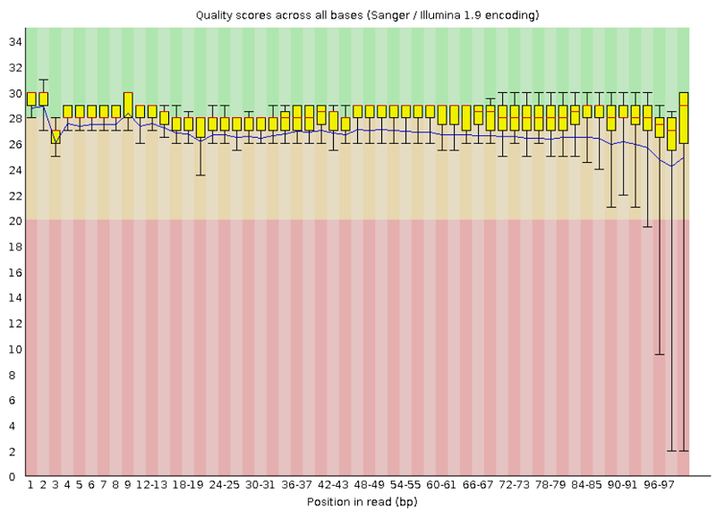
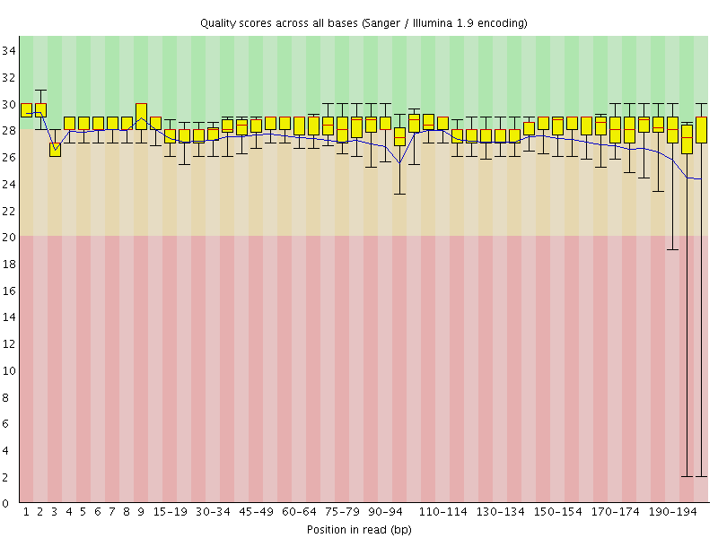
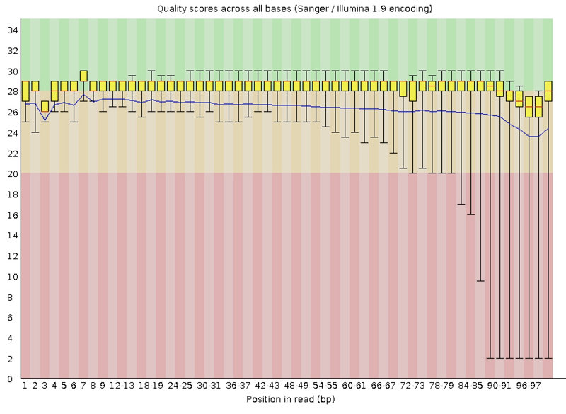
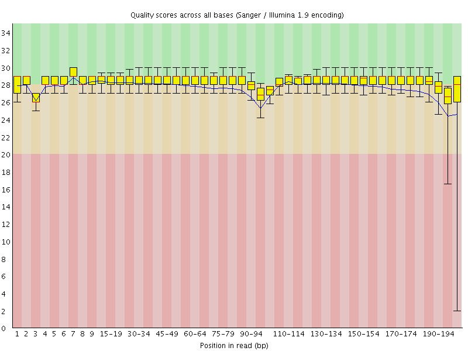
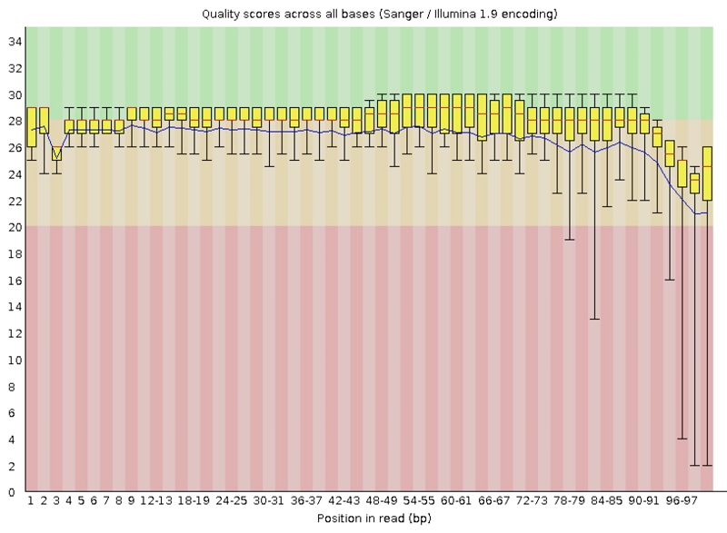
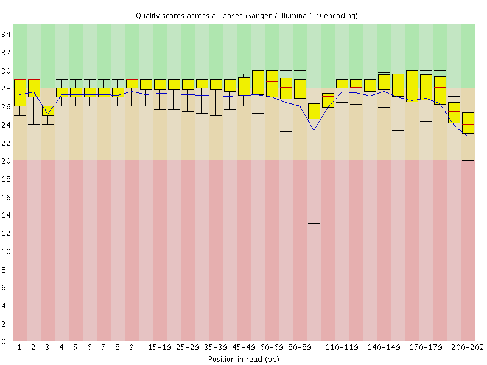

## Step 1: Initial Quality Assessment of Raw NGS Data

### Introduction
Four representative canine genomes (publicly accessible) were selected (SRR8541910, SRR8541909, SRR8541914, SRR8541934) to practice our processing pipeline in preparation for the actual sequence files. All four samples were taken from Labrador Retrievers to minimize genetic breed differences. SRR8541914 and SRR8541934 were isolated from females while SRR8541910 and SRR8541909 were taken from males.   

### Analysis
(number of reads x read length)/genome size  
 
    __Galaxy__  
    SRR8541910 coverage = (100 x 224,534,605) / 2,445,000,000= 9.2x  
    SRR8541909 coverage = (100 x 568, 822, 872) / 2,445,000,000 = 23.3x  
    SRR8541914 coverage = (100 x 185,573,093 / 2,445,000,000 = 7.6x  
    SRR8541934 coverage = (101 x 206,248,578 / 2,445,000,000 = 8.5x

    __ASC__  
    SRR8541910 coverage = (200 x 174,071,554) / 2,445,000,000 = 14.2x  
    SRR8541909 coverage = (200 x 160,095,698) / 2,445,000,000 = 13.1x  
    SRR8541914 coverage = (200 x 155,729,705) / 2,445,000,000 = 12.7x  
    SRR8541934 coverage = (200* x 206,248,578) / 2,445,000,000 = 16.9x  
            *for this sample, sequence length was reported on FASTQC as 145-202 bp  
 

### Summary
For the first step of the group project, we divided the work as follows: Cassidy and Becca did step one, Jackie, Allison, and Kyndall did step two, we all wrote the summary report for step three, and Cassidy uploaded it to Github.  

For step one, Cassidy used Dr. Stevison’s script which uses the SRA toolkit on the command line to download the sequence files onto the ASC. Becca executed a script to initiate FASTQC version 0.10.1 on the ASC command line. The job was submitted to the medium node with 4 cores and a 16gb memory limit and finished within 8 hours for our 4 genome sequence files. FASTQC was executed using 4 threads to increase computing performance and efficiency. The job completed with 91.94% parallel efficiency and 6.48% memory efficiency. Using rsync, we were able to transfer the fastqc output files from the ASC to an Ubuntu VM and visualize the html report in a web browser.   

For step two of the project, we performed a quality check on all of our files using the GUI-based Galaxy program. To do this, we first uploaded the files to Galaxy.  Using the “Faster Download and Extract Reads in FASTQ” (fasterq-dump) tool, Jackie did this process for SRR8541934 and SRR8541914, and Allison did it for SRR8541910. Kyndall did this for SRR8541909 using the “Download and Extract Reads in FASTA/Q” (fastq-dump) tool. We then used the “FastQC” tool to quality check each file, and were given statistics and graphic representations of the quality and content of our files. The tools in Galaxy utilized sra-tools v2.11.0, awscli v1.18.222, pigz v2.5, and fastqc v0.11.8.  
 

### Galaxy vs ASC
Our team noticed quite a difference between performing quality checks on the Alabama SuperComputer vs Galaxy.   

Once the sequence files were downloaded onto the ASC, it was relatively easy to use FASTQC on the command line. However, transferring the files back and forth was somewhat “clunky” and we had to troubleshoot this part of the process. Once we were able to transfer the files, we were able to open the html files in a webpage and visualize the FASTQC output. One of the benefits to the command line is the opportunity to perform a checksum/md5sum to ensure that the sequence files have not been corrupted. However, the command line interface can be intimidating for less experienced users and is dependent on availability of ASC resources.  

On the other hand, Galaxy seemed much easier to use due to its GUI interface. Having a GUI interface is helpful because it is what we are used to seeing when using a computer, and doesn’t instill fear like working on the command line does. Galaxy was also extremely user friendly with labeled tools that told you exactly what they were used for and how to use them, and when we googled a problem there were a multitude of resources to help troubleshoot. However, the biggest problem we ran into with Galaxy is that when you submit a job for the queue, you have no idea where you are in the queue or how long the job is going to take. Also, since threading doesn’t appear to be available, the data cannot be processed faster.  

Suspiciously, our group found vast differences between the FastQC reports generated by the ASC vs Galaxy. When looking at SRR8541909 in Galaxy, there were 568,822,872 total sequences and a sequence length of 100. On the ASC, there were 160,095,698 total sequences with a length of 200. The discrepancies resulted in differences in coverage – for SRR8541909, we calculated 23x vs. 13x coverage on Galaxy and ASC, respectively. The FASTQ file acquired using Galaxy is consistent with the data described in SRA Run Browser. SRA Run Browser describes SRR8541909 as having 284,411,436 spots with two reads each, or 568,822,872 reads, the same number of reads as there are in the FASTQ file downloaded using Galaxy.  

These discrepancies were concerning, though we believe it may be related to either how one of the tools used in Galaxy (“Faster Download and Extract Reads in FASTQ”) saves and Galaxy interprets paired-end data, or perhaps due to different versions of tools being used on the command line and within Galaxy. The version of SRA toolkit used on the command line was v2.8.1, while the version on Galaxy was v2.11.0. The version of FastQC utilized on the command line was v0.10.1, and within Galaxy it was v0.11.8.  

Another possible source of discrepancies is differences in parameters between jobs run using different tools. For example, when the FASTQ files were downloaded using SRA Toolkit, different parameters were used on ASC than on Galaxy. On ASC, fastq-dump was used, with no parameter specified for formatting the output data, resulting in one FASTQ file for each accession, with the paired-end reads concatenated. For the data downloaded on Galaxy using fasterq-dump (SRR8541910, SRR8541914, SRR8541934), the --split-3 option was used, resulting in three FASTQ files, one each for the forward and reverse end of paired reads and one for single reads. For data downloaded on Galaxy using fastq-dump (SRR8541909), the --split-spots option was used, resulting in one output FASTQ file with forward and reverse reads interleaved.  

The differences in these output FASTQ files led to differences in the FastQC reports. Because the forward and reverse reads were concatenated in the files downloaded using sra_download.sh, the sequence lengths are twice as long. This is visible in the Graphical Analysis, with the graphs from the ASC having reads that are twice as long as those from Galaxy. Additionally, differences in the outputs of fastq-dump and fasterq-dump led to different subsets of those outputs being analyzed with FastQC. Because the forward and reverse reads were together in one FASTQ file, data downloaded using fastq-dump (SRR8541909) was analyzed jointly using FastQC. Conversely, because the forward and reverse reads of the data downloaded using fasterq-dump (SRR8541910, SRR8541914, SRR8541934) were in separate FASTQ files, the forward and reverse reads were analyzed separately.  
 

\*\*\*\*NOTE: TESTING IF FASTQC VERSION AFFECTS OUTPUT: Using a single sequence file as a test, Becca attempted to run fastqc without indicating a specific version on the ASC (module load fastqc/ vs. module load/fastqc/0.10.1). (She also attempted to load the same version that Galaxy uses (module load/fastqc/0.11.8)  but this wouldn’t work). However, for unknown reasons, the job was unable to process.  
 

### Move forward or continue filtering?
Based on the results, our group agrees that filtering to exclude poor quality reads would be appropriate. Despite inconsistencies in the FASTQC quality reports between Galaxy and ASC, we agree that trimming of the last 10 bp should be performed for all samples due to poor quality as evidenced by Phred scores below 20. Additional trimming may need to be performed on individual samples.  
 

### Graphical Analysis
__Per Base Sequence Quality__

| Accession | Galaxy | ASC |
| :------: | :------: | :------: |
|SRR8541909| Forward and Reverse| Forward and Reverse Concatenated|
|SRR8541910| Forward | Forward and Reverse Concatenated|
|SRR8541914| Forward | Forward and Reverse Concatenated|
|SRR8541934| Forward | Forward and Reverse Concatenated|

### Contributions

Rebecca Nance: FastQC on the command line/Report  
Cassidy Schneider: Downloaded sequence files onto the ASC/Report  
Jacqueline Barry: Galaxy Analysis/Report  
Kyndall Skelton: Galaxy Analysis/Report  
Allison Sharp: Galaxysis Analysis/Report  
